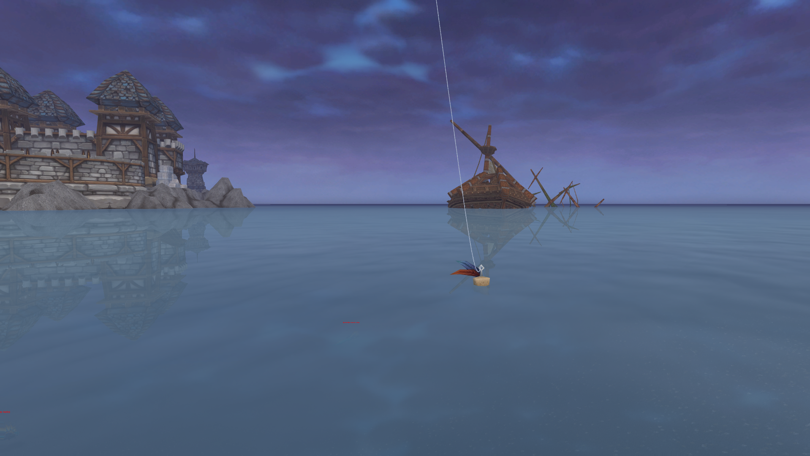

# WoW_fish_YOLO

Rewrite of https://github.com/Hester60/WoW_fish_YOLO with Claude Code

WoW_fish_YOLO is an automated fishing bot for World of Warcraft utilizing a pre-trained YOLO model. This project is developed in Python with Ultralytics and has been trained on a dataset of 2000 screenshots from different regions of the game in the classic version.

## Features

- 🎯 **YOLO Object Detection**: Real-time bobber detection with 99% accuracy
- 🔊 **Audio Detection**: Detects fish bite splash sounds
- 📊 **Statistics Tracking**: Session stats including success rate, fish/hour, detection rate
- 👀 **Live Visualization**: Real-time view of detections and bot status
- ⚙️ **Configuration System**: Save/load settings via JSON config file
- 🎨 **Colored Logging**: Clean, informative console output
- 🤖 **Anti-Detection**: Randomized delays and human-like mouse movement
- 🎣 **Lure Support**: Automatic lure application with timer

## Requirements

- Python 3.12 or higher
- A good CPU (or a GPU with CUDA if you want to update the code to use CUDA)
- 1.8GB of disk space
- Working microphone for audio detection
- Linux system with `wmctrl` and `xwininfo` (for window management)

## Installation

1. Clone the repository:
```bash
git clone <repository-url>
cd WoW_fish_YOLO
```

2. Install the required packages:
```bash
pip install -r requirements.txt
```

3. Install system dependencies (Linux):
```bash
sudo apt install wmctrl x11-utils
```

## Configuration

### First Run Setup

On first run, the bot will prompt you to configure:
- Fishing spell keybind
- Lure usage (optional)
- Lure keybind and duration

This configuration is saved to `config.json` for future use.

### Manual Configuration

Edit `config.json` to customize settings:
```json
{
    "fishing_key": "1",
    "lure_key": "2",
    "lure_duration_minutes": 10,
    "confidence_threshold": 0.5,
    "decibel_threshold": -45.0,
    "cast_duration_sec": 30,
    "viz_window_monitor": 2,
    "viz_window_width": 1200,
    "viz_window_height": 800,
    "viz_show_fps": true,
    "viz_show_audio_graph": true
}
```

#### Visualization Window Settings

- `viz_window_monitor`: Which monitor to display on (1=primary, 2=secondary, etc.)
- `viz_window_width`: Window width in pixels (default: 1200)
- `viz_window_height`: Window height in pixels (default: 800)
- `viz_window_x`: Override X position (null = auto-center on monitor)
- `viz_window_y`: Override Y position (null = auto-center on monitor)
- `viz_show_fps`: Show FPS counter (true/false)
- `viz_show_audio_graph`: Show real-time audio level graph (true/false)

### Game Setup

1. Ensure World of Warcraft is open with window title "World of Warcraft"
2. **Enable auto-loot** in game settings
3. For best results:
   - Switch to **first-person view**
   - **Hide UI** (ALT + Z or ALT + W)

The setup should look like this:



## Usage

### Basic Usage
```bash
python bot.py
```

### With Live Visualization
```bash
python bot.py --live-view
```

The live view window includes:
- **Bobber Detection**: Green bounding box with confidence score
- **Crosshair**: Red crosshair showing where the bot will click
- **Status Display**: Current bot state with color coding
- **Audio Graph**: Real-time audio level visualization with threshold line
- **FPS Counter**: Monitor performance
- **Session Stats**: Fish count, cast number, elapsed time

By default, the visualization window opens on your **second monitor** centered and in **windowed mode** (1200x800). You can customize this in `config.json`.

### Debug Mode
```bash
python bot.py --debug
```

### Custom Configuration
```bash
python bot.py --config my_config.json
```

### All Options
```bash
python bot.py --help
```

Available options:
- `--config`, `-c`: Path to config file (default: config.json)
- `--live-view`: Enable live visualization window
- `--debug`: Enable debug mode with verbose logging
- `--model`: Path to YOLO model weights (overrides config)
- `--no-config-prompt`: Skip configuration prompts

## Project Structure

```
WoW_fish_YOLO/
├── bot.py                  # Main bot application (refactored)
├── config.py               # Configuration management
├── logger.py               # Colored logging system
├── audio_detector.py       # Audio detection module
├── visualization.py        # Live view visualization
├── statistics.py           # Session statistics tracking
├── bot_states.py           # State management enums
├── monitor.py              # Window management (Linux)
├── config.json             # User configuration (auto-generated)
├── bot_old.py              # Original bot code (backup)
└── requirements.txt        # Python dependencies
```

## How It Works

1. **Detection**: YOLO model detects fishing bobber in real-time screenshots
2. **Audio Monitoring**: Listens for splash sound when fish bites (>-45dB threshold)
3. **Action**: Automatically moves cursor and right-clicks to catch fish
4. **Loop**: Waits random delay, then recasts

## Statistics

At the end of each session, you'll see statistics like:

```
==================================================
FISHING SESSION STATISTICS
==================================================
Session Duration:    1:23:45
Total Casts:         92
Fish Caught:         87
Failed Casts:        5
Success Rate:        94.6%

Bobber Detected:     91
Detection Failed:    1
Detection Rate:      98.9%

Avg Cast Time:       54.2s
Fish per Hour:       62.5
==================================================
```

## Troubleshooting

### Bot can't find game window
- Ensure WoW window title is exactly "World of Warcraft"
- Check that `wmctrl` is installed: `wmctrl -l`

### Audio detection not working
- Check microphone is working: `arecord -l`
- Adjust `decibel_threshold` in config.json (try -40 or -50)

### Bobber not detected
- Use `--live-view` to see what the bot sees
- Ensure first-person view and UI is hidden
- Try adjusting `confidence_threshold` in config

### Model file not found
- Default path: `../runs/detect/train3/weights/best.pt`
- Check `archive/best.pt` or specify with `--model` flag

## Improvements & Future Work

- **Training**: Additional training with screenshots from different regions could enhance accuracy
- **GPU Support**: Add CUDA support for faster inference
- **Cross-platform**: Windows/Mac support for window management
- **Advanced Anti-Detection**: More sophisticated randomization patterns
- **GUI**: Optional graphical interface for configuration

## Safety & Disclaimer

This bot is for educational purposes. Use at your own risk. Automated gameplay may violate game terms of service.
